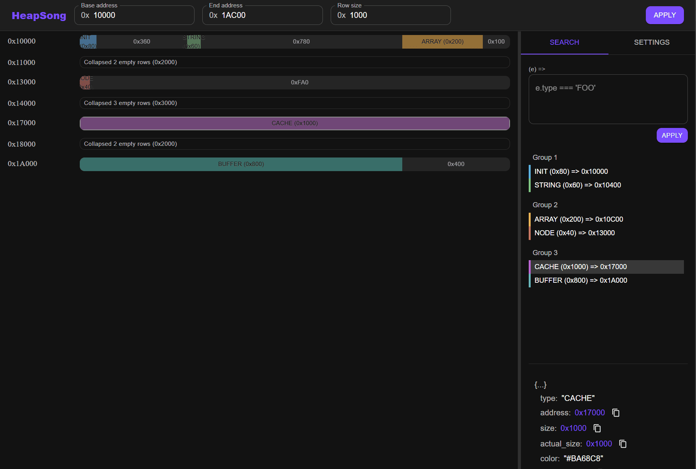

# HeapSong
heap visualizer written by cursor completely (so don't even try to look at the code). 




json input format:
```
[
    {
        "type": string,
        "address": hex string or int,
        "size": hex string or int,
        "actual_size": hex string or int,
        "color": color string for js,
        "group_id": int,
        // Can add extra properties for search
    },
    ...
]
```

See [sample](public/sample-heap.json) for a sample.

It probably use floating point to represent numbers, so you on user mode addresses only...